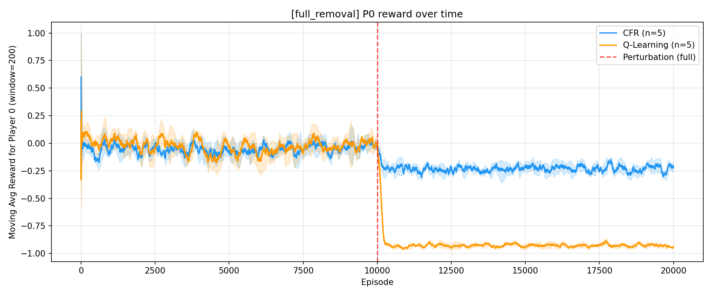
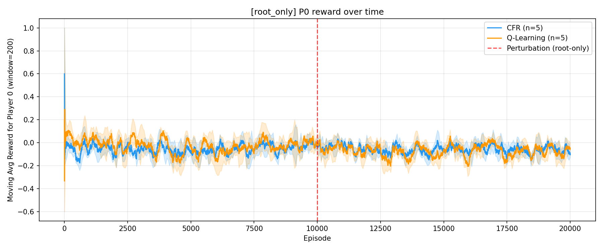
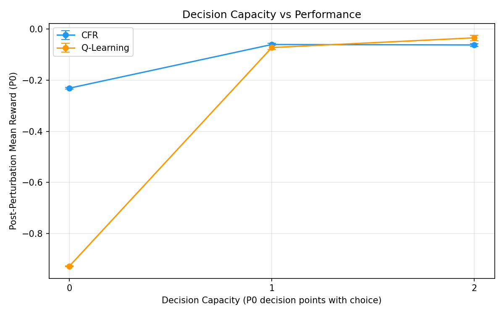
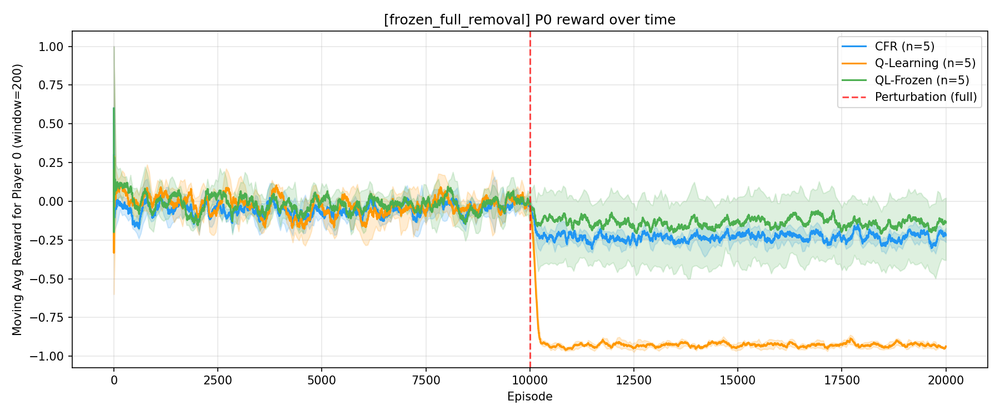
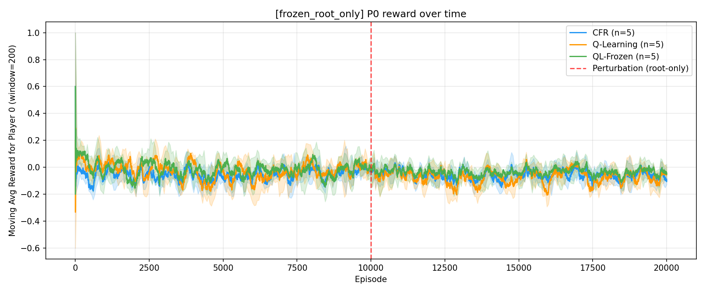
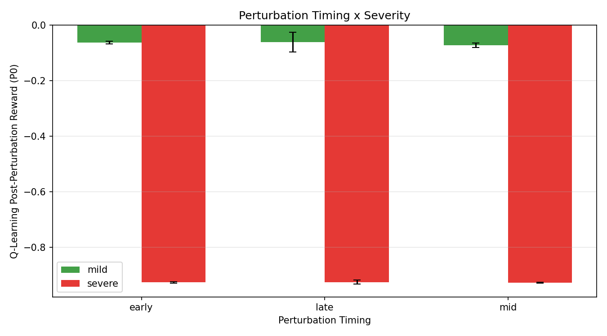
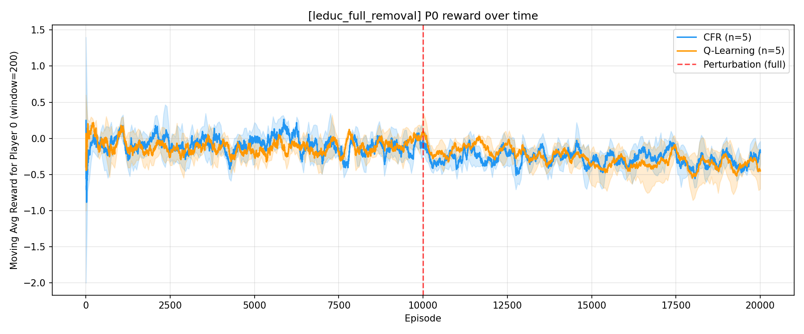
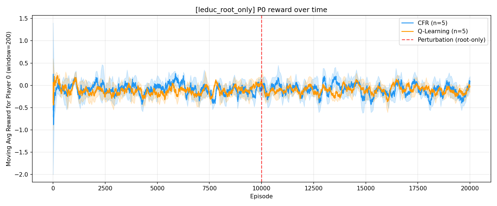

# A Minimal Decision Capacity Threshold Prevents Catastrophic Exploitation in Self-Play RL

## Abstract

We show that a minimal threshold in decision capacity determines whether
self-play RL agents collapse under asymmetric rule perturbations.
In Kuhn and Leduc Poker, Player 0 loses the ability to bet or raise --
either at all decision nodes or only at the opening move.  Across 5 seeds
with paired card deals:

- **Complete removal** causes adaptive Q-learning to collapse to near-maximal
  exploitation (Kuhn: -0.93; Leduc: -0.31), while a frozen Q-learning
  baseline stays near -0.14, confirming the collapse is co-adaptation-driven.
- **Preserving a single decision point** stabilises Q-learning near Nash
  (Kuhn: -0.07; Leduc: -0.10).
- The pattern replicates across both games and is **timing-invariant**:
  early, mid, and late perturbation produce identical collapse severity.
- Collapse is **fast**: Q-learning crosses the -0.5 threshold within 4
  episodes of perturbation on average in Kuhn.

These results establish a sharp threshold effect between zero and minimal
decision capacity that is game-general, not Kuhn-specific.

---

## 1. Related Work

**Regret minimisation in games.**  Counterfactual regret minimisation (CFR)
[1] is the standard algorithm for computing Nash equilibria in imperfect-
information games.  Its convergence guarantees in two-player zero-sum games
are well-established, and it has been scaled to large games including
poker [2].  We use CFR as a planning baseline whose frozen strategy
represents the best-case response to perturbation without adaptation.

**Self-play reinforcement learning.**  Self-play has driven major advances
in game-playing agents, from TD-Gammon [3] through AlphaGo and AlphaZero
[4].  However, self-play dynamics can be unstable: agents may cycle,
overfit to their own weaknesses, or fail to generalise [5].  Our work
isolates a specific failure mode -- co-adaptation-driven collapse under
asymmetric constraint changes -- that is distinct from the cyclic
instabilities studied in general-sum games.

**Robustness and perturbation in multi-agent RL.**  Prior work on robustness
in MARL has focused on adversarial perturbations to observations or rewards
[6], domain randomisation, or opponent modelling under distribution shift.
Our setting differs: we perturb the *action space* of one player
asymmetrically, which eliminates decision points rather than adding noise.
This structural perturbation reveals a qualitative threshold effect that
continuous perturbations (e.g., reward noise) would not produce.

---

## 2. Background

**Kuhn Poker.**  3 cards (J < Q < K), 2 players, 2 actions (pass, bet), ante 1.
Nash equilibrium value for P0: -1/18 = -0.056.

**Leduc Poker.**  6 cards (J, Q, K x 2 suits), 2 players, 3 actions (fold,
check/call, raise), 2 rounds, fixed-limit betting (round 1: raise=2;
round 2: raise=4; max 2 raises/round).  Nash P0 value: -0.087.  Our
from-scratch CFR implementation converges to -0.0866 after 5,000 iterations,
matching the known analytical value.

**Agents.**

| Agent | Description |
|---|---|
| CFR | Counterfactual regret minimisation.  Trained to Nash offline (deterministic); frozen strategy shared across seeds. |
| Q-Learning | Tabular, epsilon-greedy (eps=0.15), MC terminal updates.  Continues learning after perturbation. |
| QL-Frozen | Identical to Q-Learning during training; at perturbation, Q-table and epsilon freeze (greedy). |

---

## 3. Methodology

Each experiment: 5 seeds x 20,000 episodes.  Perturbation applied to Player 0
at episode 10,000 (unless noted otherwise).

**RNG design.**  Four independent streams per seed:

1. Card deals -- shared between all agents (paired comparison)
2. CFR action selection
3. Q-Learning action selection
4. QL-Frozen action selection

CFR training: deterministic full-tree enumeration, run once.

**Statistics.**  Paired t-tests across seeds, bootstrap 95% CIs
(10,000 resamples), Cohen's d.  Adaptive burn-in: first 25% of each phase
(capped at 5k/2k) excluded for stable estimates.  Due to low across-seed
variance under paired evaluation, effect sizes are large and should be
interpreted qualitatively as indicating direction and reliability of effects
rather than as conventional benchmarks.

**Time-to-collapse.**  First episode where the 200-episode moving average
drops below -0.5.

**Decision capacity.**  The number of reachable information sets in which
the affected agent retains more than one legal action after perturbation.
Capacity 0 means every P0 decision is forced; capacity 1 means exactly one
information set retains a genuine choice.

---

## 4. Kuhn Poker: Core Experiments

### 4.1 Full Removal (Capacity 0)

Bet removed from P0 at all decision nodes.  P0 has zero remaining decisions:
forced check, forced fold.

| Agent | Pre (95% CI) | Post (95% CI) | p | d |
|---|---|---|---|---|
| CFR | -0.053 [-0.066, -0.041] | -0.231 [-0.235, -0.228] | <0.0001 | -11.9 |
| Q-Learning | -0.035 [-0.046, -0.025] | **-0.927 [-0.929, -0.925]** | <0.0001 | -66.1 |

Q-Learning collapses to near -1.0.  The self-play opponent learns that P0
always folds and converges to unconditional betting.  The epsilon floor
(0.15) prevents the average from reaching exactly -1.0.

CFR drops to -0.23 -- bounded because the opponent (also CFR) still plays
Nash.

**Collapse speed.**  Q-Learning: 5/5 seeds collapsed (mean delay: 4 episodes).
Collapse is effectively instantaneous.

### 4.2 Root-Only Removal (Capacity 1)

Bet removed from P0 only at the root.  P0 can still call or fold facing
a bet (the "pb" node).

| Agent | Pre (95% CI) | Post (95% CI) | p | d |
|---|---|---|---|---|
| CFR | -0.053 [-0.066, -0.041] | -0.061 [-0.065, -0.055] | 0.27 | -0.6 |
| Q-Learning | -0.035 [-0.046, -0.025] | -0.073 [-0.081, -0.064] | 0.001 | -3.6 |

CFR barely shifts (p = 0.27, not significant) -- removing an action at an
indifference point does not change the equilibrium value.

Q-Learning drops modestly (-0.037 delta) then stabilises.  The single
remaining decision point forces the opponent to bet honestly, bounding
exploitation.

**Collapse speed.**  Q-Learning: 1/5 seeds crossed -0.5 (transient noise,
not sustained collapse).

### 4.3 Decision Capacity Sweep

| Capacity | Description | CFR Post | QL Post |
|---|---|---|---|
| 0 | All actions removed | -0.231 | **-0.927** |
| 1 | Root bet removed, call/fold preserved | -0.061 | -0.073 |
| 2 | No perturbation (control) | -0.062 | -0.034 |

The jump from 0 to 1 is catastrophic (delta -0.85 for QL).  The jump from
1 to 2 is marginal (delta +0.04).  This is a **sharp threshold effect**:
the relationship between decision capacity and exploitability is
discontinuous at the zero-to-one boundary, not a smooth gradient.

---

## 5. Frozen vs Adaptive Q-Learning

### 5.1 Under Full Removal

| Agent | Post (95% CI) | Collapsed? |
|---|---|---|
| CFR | -0.231 [-0.235, -0.228] | 4/5 transient |
| Q-Learning | **-0.927 [-0.929, -0.925]** | 5/5 (delay: 4 eps) |
| QL-Frozen | -0.141 [-0.406, -0.007] | 2/5 |

Q-Learning vs QL-Frozen: diff = -0.787, p = 0.004, d = -2.6.

The frozen agent avoids collapse because its policy doesn't shift toward
always-fold.  Without the co-adaptation spiral where P1 learns to exploit
P0's increasing passivity, the perturbation alone causes only moderate
degradation.

**Key finding:** The catastrophic collapse is **co-adaptation-driven**.
This isolates continued adaptation under constraint, rather than the
quality of the pre-perturbation policy, as the mechanism of collapse.
The perturbation creates the vulnerability; self-play learning converts it
into exploitation.

### 5.2 Under Root-Only Removal

| Agent | Post (95% CI) |
|---|---|
| CFR | -0.061 [-0.065, -0.055] |
| Q-Learning | -0.073 [-0.081, -0.064] |
| QL-Frozen | -0.037 [-0.094, -0.007] |

No significant differences (QL vs QL-Frozen: p = 0.32).  When capacity >= 1,
neither agent collapses regardless of whether learning continues.

---

## 6. Perturbation Severity Sweep

Varying **when** (episode 3k / 10k / 17k) and **how strongly** (severe =
all nodes, mild = root only) the perturbation is applied.

### 6.1 Severe (Capacity 0)

| Timing | Pert. Episode | CFR Post | QL Post |
|---|---|---|---|
| Early | 3,000 | -0.229 | **-0.926** |
| Mid | 10,000 | -0.231 | **-0.927** |
| Late | 17,000 | -0.232 | **-0.925** |

Collapse is **timing-invariant** under severe perturbation.  Whether Q-values
have barely begun learning (early) or are well-converged (late), the outcome
is identical.

### 6.2 Mild (Capacity 1)

| Timing | Pert. Episode | CFR Post | QL Post |
|---|---|---|---|
| Early | 3,000 | -0.054 | -0.063 |
| Mid | 10,000 | -0.061 | -0.073 |
| Late | 17,000 | -0.056 | -0.061 |

No collapse at any timing.  Mild perturbation is benign regardless of when
it occurs.

**Implication:** Collapse is **structural**, not dependent on training
stage or convergence level.  What determines the outcome is whether the
perturbation eliminates all contingent responses (capacity), not when it
occurs in the learning trajectory or how refined the agent's policy has
become.

---

## 7. Stochastic Masking

Perturbation applied with 50% probability per episode (root-only removal,
Kuhn).

| Agent | Post (95% CI) | p |
|---|---|---|
| CFR | -0.066 [-0.069, -0.064] | 0.14 |
| Q-Learning | -0.049 [-0.058, -0.037] | 0.06 |

Intermittent perturbation does not cause collapse.  Q-Learning adapts to the
stochastic environment and stabilises near Nash.

---

## 8. Leduc Poker: Cross-Game Replication

### 8.1 Full Removal (Raise removed at all P0 nodes)

| Agent | Pre (95% CI) | Post (95% CI) | p | d |
|---|---|---|---|---|
| CFR | -0.094 [-0.111, -0.078] | -0.281 [-0.310, -0.247] | 0.002 | -3.4 |
| Q-Learning | -0.122 [-0.146, -0.098] | -0.307 [-0.429, -0.219] | 0.07 | -1.1 |

Both agents degrade.  Q-Learning's post-perturbation drop is not
statistically significant at conventional thresholds (p = 0.07), but the
direction of the effect is consistent with Kuhn and aligns with the
capacity-based explanation.  The collapse is less extreme than Kuhn
(-0.31 vs -0.93) because Leduc retains fold/check-call options even after
removing raise, so P0 is not completely passive.

**Collapse speed.**  CFR: 5/5 seeds (delay: 132 eps).  Q-Learning: 5/5
seeds (delay: 104 eps).  Slower than Kuhn due to the larger state space.

### 8.2 Root-Only Removal (Raise removed at root only)

| Agent | Pre (95% CI) | Post (95% CI) | p |
|---|---|---|---|
| CFR | -0.094 [-0.111, -0.078] | -0.103 [-0.128, -0.066] | 0.75 |
| Q-Learning | -0.122 [-0.146, -0.098] | -0.102 [-0.131, -0.073] | 0.40 |

Neither agent degrades significantly.  The same capacity-1 stabilisation
observed in Kuhn replicates in Leduc.

### 8.3 Cross-Game Comparison

| | Kuhn (capacity 0) | Leduc (capacity 0) |
|---|---|---|
| QL Post | **-0.927** | **-0.307** |
| QL Collapse delay | 4 eps | 104 eps |
| CFR Post | -0.231 | -0.281 |

| | Kuhn (capacity 1) | Leduc (capacity 1) |
|---|---|---|
| QL Post | -0.073 | -0.102 |
| Collapse? | No | No |

The **qualitative pattern** is identical: catastrophic collapse at capacity 0,
stability at capacity >= 1.  The **quantitative severity** scales with how
much residual decision capacity remains -- Leduc retains fold/check-call even
under "full" raise removal, which partially buffers the collapse.

---

## 9. Variance Decomposition

Reward variance decomposed into environment (card deals) and policy
(action selection) components by fixing one RNG source across seeds.

**Kuhn, full removal:**

| Agent | V_total | V_env | V_policy | V_interaction |
|---|---|---|---|---|
| CFR | 0.000021 | 0.000015 | 0.000028 | -0.000022 |
| Q-Learning | 0.000005 | 0.000007 | 0.000006 | -0.000008 |

Post-perturbation Q-Learning variance is extremely low across all sources.
The near-zero total variance confirms that collapse corresponds to a
**deterministic fixed point** of the self-play dynamics: the opponent
converges to the same exploitation strategy regardless of card randomness
or exploration noise.  This distinguishes collapse from high-variance
instability -- it is an attractor, not a fluctuation.

---

## 10. Summary of Findings

| Finding | Evidence |
|---|---|
| Capacity 0 -> 1 is a sharp threshold | QL reward jumps from -0.93 to -0.07 (Kuhn); similar in Leduc |
| Collapse is co-adaptation-driven | QL-Frozen avoids collapse (p = 0.004 vs adaptive QL) |
| Collapse is structural, not timing-dependent | Same outcome at ep 3k, 10k, 17k regardless of convergence level |
| Collapse is fast | 4-episode mean delay in Kuhn |
| Pattern replicates across games | Qualitatively identical in Kuhn and Leduc |
| Stochastic perturbation is benign | 50% mask probability does not cause collapse |

---

## 11. Conclusion

We have shown that a minimal threshold in decision capacity determines
whether self-play RL agents catastrophically collapse under asymmetric
action-space perturbations.  A single remaining contingent response
(call/fold in Kuhn, any non-forced action in Leduc) compels the opponent
to maintain strategic diversity, bounding losses near Nash equilibrium.
When no contingent responses remain, the opponent can enforce a dominant
strategy through co-adaptation: the constrained agent's forced passivity
removes any incentive for the opponent to play honestly, collapsing the
game to deterministic exploitation within episodes.

This threshold is structural.  It does not depend on how well-trained the
agent is, when in the learning trajectory the constraint is imposed, or
the specific game -- only on whether the agent retains at least one genuine
decision.

**Limitations.**  Our experiments are restricted to small tabular games
(Kuhn: 12 info sets; Leduc: 288 info sets) with exact CFR solutions and
tabular Q-learning.  Whether the threshold effect persists under function
approximation, larger state spaces, or continuous action spaces remains
open.  The number of seeds (5) is sufficient for detecting large effects
but limits statistical power for subtler comparisons (e.g., Leduc QL
full removal, p = 0.07).

**Future work.**  Natural extensions include: (i) scaling to larger games
(e.g., limit Texas Hold'em) using neural network function approximation;
(ii) studying whether the threshold generalises to non-zero-sum or
cooperative settings; (iii) formalising the connection between decision
capacity and exploitability bounds in extensive-form games; and
(iv) investigating whether graduated capacity reduction (rather than binary
removal) produces a smooth degradation curve in richer games.

---

## References

[1] M. Zinkevich, M. Johanson, M. Bowling, and C. Piccione.
Regret minimization in games with incomplete information.
*Advances in Neural Information Processing Systems*, 2007.

[2] M. Bowling, N. Burch, M. Johanson, and O. Tammelin.
Heads-up limit hold'em poker is solved.
*Science*, 347(6218), 145--149, 2015.

[3] G. Tesauro.
TD-Gammon, a self-teaching backgammon program, achieves master-level play.
*Neural Computation*, 6(2), 215--219, 1994.

[4] D. Silver, T. Hubert, J. Schrittwieser, et al.
A general reinforcement learning algorithm that masters chess, shogi, and Go through self-play.
*Science*, 362(6419), 1140--1144, 2018.

[5] M. Lanctot, V. Zambaldi, A. Gruslys, et al.
OpenSpiel: a framework for reinforcement learning in games.
*arXiv preprint arXiv:1908.09453*, 2019.

[6] A. Gleave, M. Dennis, C. Wild, N. Kant, S. Levine, and S. Russell.
Adversarial policies: attacking deep reinforcement learning.
*International Conference on Learning Representations*, 2020.
